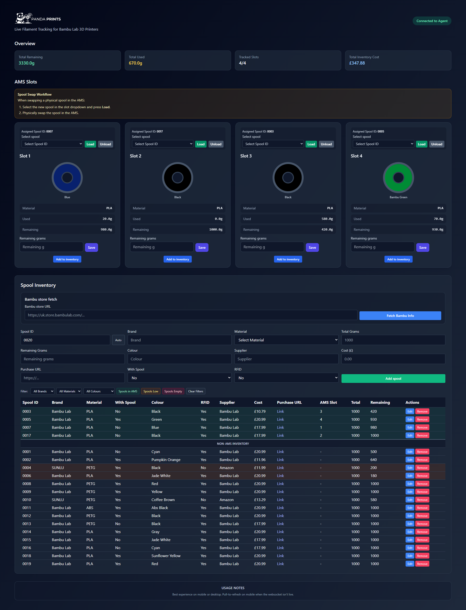

A self-hosted filament tracking dashboard for Bambu Lab printers. Tracks AMS tray state live via MQTT, manages a spool inventory, and lets you assign spools to AMS slots to monitor remaining filament.

> Project status: currently functional, but still a work in progress.
>
> Current deployment: hosted on a Raspberry Pi, with remote access provided through a Cloudflare Tunnel and secured with Cloudflare Zero Trust.

## Dashboard Preview



## Features

- **Live AMS sync** — tray colour, type, and remaining grams are updated in real time via MQTT from your Bambu printer
- **Spool inventory** — add, edit, and delete spools with full metadata (brand, material, colour, cost, purchase URL, etc.)
- **Inventory filters** — narrow the spool table by brand, material, colour, AMS assignment, low stock, or empty spools
- **Assign spools to AMS trays** — link an inventory spool to a physical tray slot; remaining grams sync automatically
- **Sync grace period** — after pressing Load, auto-sync is paused briefly so a physical spool swap doesn't overwrite the wrong row
- **Refresh AMS** — force the printer to re-report all AMS tray state on demand via an MQTT `pushall` command
- **Manual stock override** — update remaining grams for a tray directly from the dashboard at any time
- **Auto-populate from URL** — paste a Bambu Lab product URL and the dashboard pre-fills spool metadata automatically
- **WebSocket live updates** — all connected browser tabs update instantly without polling
- **Persistent storage** — SQLite database stored in a Docker volume (`./backend/data/pandaprints.db`)

## Requirements

- Docker and Docker Compose

## Setup

### 1. Configure environment

```bash
cp .env.example .env
```

Edit `.env` with your printer details:

```env
# Bambu Printer MQTT Details
PRINTER_IP=192.168.1.100
PRINTER_SERIAL=00M00A000000000
PRINTER_ACCESS_CODE=12345678

# Dashboard Config
PORT=3001
WS_PORT=8080
AMS_ASSIGN_SYNC_GRACE_MS=30000
SPOOL_COST_CURRENCY=GBP
```

| Variable | Description |
|---|---|
| `PRINTER_IP` | Local IP address of your Bambu printer |
| `PRINTER_SERIAL` | Printer serial number (shown in Bambu Studio) |
| `PRINTER_ACCESS_CODE` | LAN access code (shown on the printer screen) |
| `PORT` | Backend HTTP port (default: `3001`) |
| `WS_PORT` | WebSocket port for live updates (default: `8080`) |
| `AMS_ASSIGN_SYNC_GRACE_MS` | Milliseconds to pause auto-sync after pressing Load, to allow time for a physical spool swap (default: `30000`) |
| `SPOOL_COST_CURRENCY` | ISO 4217 currency code used when displaying spool costs, for example `GBP`, `USD`, or `EUR` |

### 2. Start

```bash
docker compose up -d --build
```

Open the dashboard at [http://localhost:3000](http://localhost:3000).

Use the filter controls above the inventory table to quickly narrow the list by brand, material, colour, or stock status.

### Rebuilding after config changes

```bash
docker compose up -d --build
```

## Remote Access via Cloudflare

This is the current remote access setup used for the dashboard: the app runs locally on a Raspberry Pi, is exposed publicly through a Cloudflare Tunnel, and is protected by a Cloudflare Zero Trust application with an email-based access policy.

### 1. Install `cloudflared` on the Raspberry Pi

```bash
curl -L https://github.com/cloudflare/cloudflared/releases/latest/download/cloudflared-linux-arm64.deb -o cloudflared.deb
sudo dpkg -i cloudflared.deb
```

If your Pi is running a 32-bit OS, download the matching ARM package from Cloudflare instead of the `arm64` build.

### 2. Authenticate `cloudflared`

```bash
cloudflared tunnel login
```

This opens a Cloudflare login flow in your browser. Authorize the tunnel against the zone for your domain.

### 3. Create the tunnel

```bash
cloudflared tunnel create pandaprintsdash
```

This creates a named tunnel and stores its credentials locally.

### 4. Configure the tunnel ingress

Create [cloudflared/config.yml](cloudflared/config.yml) on the Pi with your tunnel ID and local service target:

```yaml
tunnel: YOUR_TUNNEL_ID
credentials-file: /home/pi/.cloudflared/YOUR_TUNNEL_ID.json

ingress:
  - hostname: www.domain.com
    service: http://localhost:3000
  - service: http_status:404
```

If your Docker stack is bound differently, replace `http://localhost:3000` with the correct local address.

### 5. Route DNS through the tunnel

Create the DNS route for the `www` hostname:

```bash
cloudflared tunnel route dns pandaprintsdash www.domain.com
```

In Cloudflare DNS, the current setup is:

- `AAAA` record for `@` pointing to `100::` with proxy enabled
- tunnel-backed `www` hostname for the dashboard with proxy enabled

The site is served from `https://www.domain.com`.

### 6. Install and run the tunnel as a service

```bash
sudo cloudflared service install
sudo systemctl enable cloudflared
sudo systemctl start cloudflared
```

To verify it is running:

```bash
systemctl status cloudflared
```

### 7. Redirect the apex domain to `www`

Use a Cloudflare rule so requests for `domain.com` redirect to `https://www.domain.com`.

Current rule logic:

- If hostname equals `domain.com`
- Then redirect to `concat("https://www.domain.com", http.request.uri.path)`
- Status code: `301`

### 8. Protect the dashboard with Cloudflare Zero Trust

In Cloudflare Zero Trust, create a self-hosted application for `www.domain.com` and attach an email-based access policy.

Recommended settings:

- Application type: self-hosted
- Domain: `www.domain.com`
- Policy action: allow
- Include rule: approved email addresses or approved email domain

This ensures the dashboard is not publicly reachable without authenticating through Cloudflare Access.

## Spool Swap Workflow

When swapping a physical spool in the AMS:

1. Select the new spool in the AMS slot dropdown in the dashboard and press **Load**
2. Physically swap the spool in the AMS

Pressing Load first triggers the sync grace period, preventing the printer's next MQTT update from updating the wrong spool's remaining gram count.

## API Endpoints

### Spools

| Method | Endpoint | Description |
|---|---|---|
| `GET` | `/api/spools` | List all inventory spools |
| `POST` | `/api/spools` | Create a new spool |
| `PUT` | `/api/spools/:id` | Update a spool |
| `DELETE` | `/api/spools/:id` | Delete a spool |
| `POST` | `/api/spools/fetch-url` | Fetch and parse metadata from a product URL |

### AMS

| Method | Endpoint | Description |
|---|---|---|
| `GET` | `/api/ams_state` | Get current state of all AMS trays |
| `POST` | `/api/ams/:trayId/assign-spool` | Assign an inventory spool to a tray |
| `POST` | `/api/ams/:trayId/unassign-spool` | Unassign the spool from a tray |
| `POST` | `/api/ams/:trayId/stock` | Manually update remaining grams for a tray |
| `POST` | `/api/ams/refresh` | Force the printer to resend all AMS tray state via MQTT |

#### POST /api/spools — example body

```json
{
  "spool_id": "0001",
  "name": "True Silk PLA",
  "brand": "Bambu Lab",
  "material": "PLA",
  "color": "True Silk",
  "type": "Spool",
  "rfid": "Yes",
  "supplier": "Bambu Lab",
  "cost": 49.99,
  "purchase_url": "https://bambulab.com/...",
  "total_grams": 1000,
  "remaining_grams": 1000,
  "with_spool": 1
}
```

#### POST /api/spools/fetch-url — example body

```json
{ "url": "https://bambulab.com/en-gb/filament/pla-basic" }
```

Auto-fills: `name`, `brand`, `material`, `color`, `supplier`, `rfid`, `with_spool`, `total_grams`, `remaining_grams`.

#### POST /api/ams/:trayId/stock — example body

```json
{ "grams_remaining": 750, "grams_used": 250 }
```

## Troubleshooting

- **Backend exits with code 139** — ensure the Docker image in `backend/Dockerfile` uses `node:18-bullseye-slim` and not an Alpine variant (SQLite native bindings require glibc).
- **Tray state not updating** — verify `PRINTER_IP`, `PRINTER_SERIAL`, and `PRINTER_ACCESS_CODE` in `.env` are correct and the printer is reachable on the local network.
- **Wrong spool remaining grams updated after swap** — increase `AMS_ASSIGN_SYNC_GRACE_MS` in `.env` and rebuild. The default `30000` (30 seconds) gives time to physically swap the spool after pressing Load.

